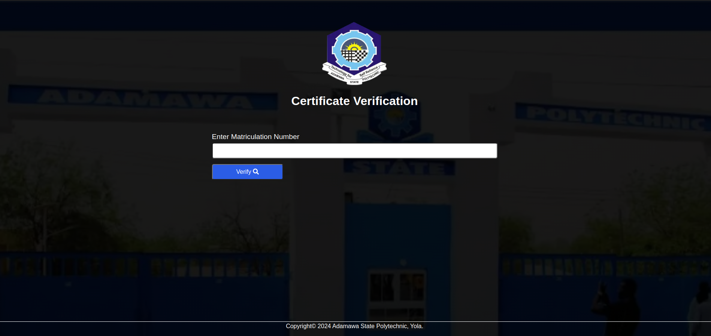
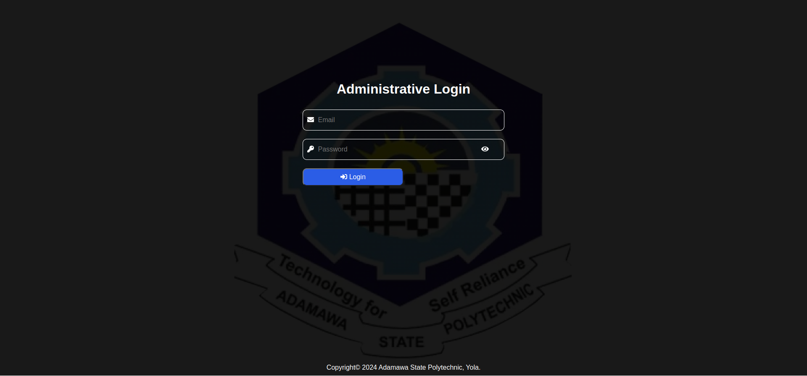
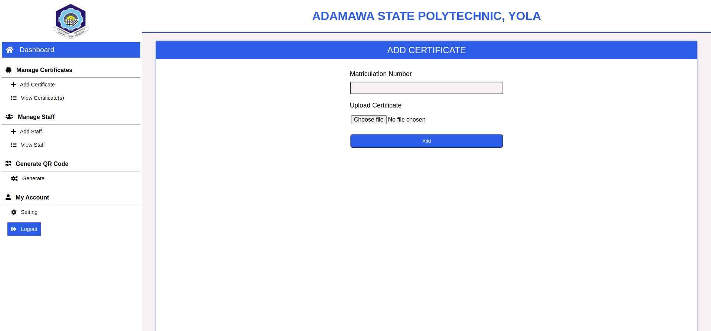

# Certificate Verification System Using QR Code

Certificate Verification System Using QR Code is a web app developed as my final year project in 2021. The system is developed using LAMP Stack. It allows anyone interesting in verifying the authenticity and the ownership of a certificate to do just that by scanning a QR code on the certificate.
The system also allows you to enter matriculation number of a certificate claimer to verify certificate.

## Table of Contents

- [Screenshots](#Screenshots)
- [Built](#built)
- [Features](#Features)
- [Installation](#Installation)
- [Usage](#Usage)

## Screenshots {#Screenshots}

### _Verification Page_

### _Admin Login Page_

### _Dashboard Page_

## Built With {#built}

- HTML
- CSS
- JavaScript
- QR Code Library
- PHP
- MySQL

## Features

- Generate QR Code
- Verify Certificate using QR Code
- Verify Certificate using Matriculation Number
- Upload Certificate
- Manage System Users

## Installation

1. Clone the repository
2. Download XAMPP and install
3. Create a folder 'cvs' in htdocs and extract or move all the files from this repo
4. Launch XAMPP and start apache and mysql server
5. Open a web browser, type localhost in the address bar
6. Click on phpMyAdmin
7. Create a database with the name 'cvs'
8. Click on import
9. Browse and select 'cvs.sql' which is located with in cvs folder

## Usage

If the system where on production, you will simply scan the QR Code on the certificate or visit the website and enter matriculation number.

If you want to run it locally, you would need to install it manually on your local machine. In such case you will follow the installation steps above.

### To verify certificate with Matriculation Number

- Open a web browser and type localhost/cvs in the address bar

### Login and perform administrative work

- Open a web browser and type localhost/cvs/admin in the address bar

**NOTE**
There are two types of admin role;
Admin and Staff

#### Default accounts

| Email              | Password | Role  |
| ------------------ | -------- | ----- |
| johndoe@gmail.com  | 1234     | Admin |
| johnsmithgmail.com | 1234     | Staff |
